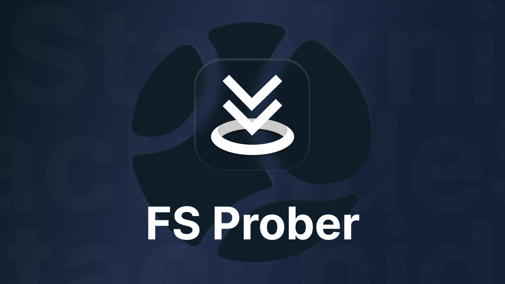

# FS Prober



The **FS Prober** package  is a browser-friendly NPM package for extracting file and folder structures from user-selected files or directories.

# What does it do?

The **FS Prober** package extends [react-dropzone](https://react-dropzone.js.org/) by adding support for *detecting empty folders*, including deeply nested ones. It maintains full compatibility with `react-dropzone`, adhering to the same props and return types while enhancing its functionality.

While `react-dropzone` provides a simple React hook for creating an HTML5-compliant drag-and-drop zone, it has limitations in detecting empty folders, as noted in this [GitHub issue](https://github.com/react-dropzone/react-dropzone/issues/986#issuecomment-687603291).

FS Prober uses standard file system APIs, ensuring that even empty folders within a directory structure are correctly detected. It is tested with the latest versions of Chrome, Firefox, Edge, and Safari and supports both the [File and Directory Entries API](https://developer.mozilla.org/en-US/docs/Web/API/File_and_Directory_Entries_API) and the [WICG File System Access API](https://developer.mozilla.org/en-US/docs/Web/API/File_System_API).

> [!NOTE]  
> File and Directory Entries API is available in all latest browsers. But the WICG File System Access API might not be available in all browsers yet.
> FS Prober uses File and Directory Entries API by default.

The FS Prober package extends the functionality of [`useDropzone`](https://react-dropzone.js.org/#usage) by using standard File System APIs, allowing it to detect even deeply nested empty folders.

## Installation

```sh
# NPM
npm install @knide/fs-prober

# Yarn
yarn add @knide/fs-prober
```

## Usage

Check out the [documentation](https://stacknide.github.io/fs-prober/docs/usage) for detailed usage instructions.
